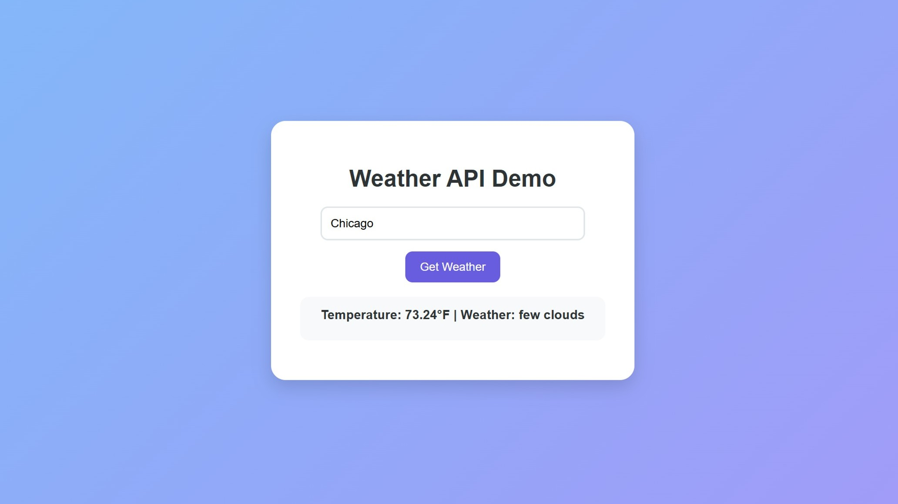

# REST API Demos

**REST API Demos** is a beginner-friendly repository created for a technical meeting for the Association for Computing Machinery for Women (ACM-W) club at The University of Alabama to introduce members to **REST APIs**.

The repository contains two simple projects that demonstrate how applications communicate with external services using **HTTP requests** and **JSON responses**:

* **Weather API Demo**: a simple frontend web app that retrieves weather information for a city using the **OpenWeatherMap API**.
* **OpenAI API Demo**: a small **Flask application** that sends prompts to the **OpenAI API** and displays the generated response in a webpage.

<p align="center">
  
</p>

<p align="center">
  
</p>

# Features

## Weather API Demo

**City Weather Lookup**

* Enter a city name
* Sends a request to the OpenWeatherMap API
* Displays temperature and weather conditions

**REST API Request Example**

* Demonstrates a **GET request** using JavaScript `fetch()`
* Parses JSON data returned from the API


## OpenAI API Demo

**AI Prompt Interface**

* Enter a prompt in the browser
* Sends a request to a backend Flask server
* Displays the AI-generated response

**REST API Request Example**

* Demonstrates a **POST request**, a **GET request**, and a **DELETE request**
* Sends JSON data to the OpenAI API
* Returns generated text


# Tech Stack

## Frontend

* HTML
* CSS
* JavaScript
* Fetch API

## Backend (OpenAI Demo)

* Python
* Flask
* python-dotenv

## APIs Used

* OpenWeatherMap API
* OpenAI API


# Repository Structure

```bash
rest-api-demos
│
├── assets
│   ├── openai-api-demo.jpg
│   └── weather-api-demo.jpg
│
├── weather-api-demo
│   ├── config.js
│   ├── index.html
│   ├── script.js
│   └── style.css
│
├── openai-api-demo
│   ├── app.py
│   ├── static
│   │   ├── script.js
│   │   └── style.css
│   ├── templates
│   │   └── index.html
│   └── .env
│
├── README.md
└── REST APIs Presentation Slides.pdf
```


# Setup Instructions

## 1. Clone the Repository

```bash
git clone https://github.com/stephaniebittner802/rest-api-demos.git
cd rest-api-demos
```


# Weather API Demo Setup

Navigate to the project folder:

```bash
cd weather-api-demo
```

Create a **config.js** file with your API key:

```javascript
const CONFIG = {
  API_KEY: "your_openweathermap_api_key"
}
```

You can obtain a free API key from:

https://openweathermap.org

Open the project in your browser:

```
index.html
```


# OpenAI API Demo Setup

Navigate to the OpenAI project:

```bash
cd openai-api-demo
```

Create a virtual environment:

```bash
python3 -m venv .venv
source .venv/bin/activate
```

Install dependencies:

```bash
pip install flask python-dotenv openai
```

Create a `.env` file:

```env
OPENAI_API_KEY=your_openai_api_key
```

Run the Flask server:

```bash
python app.py
```

Open the application in your browser.


# Learning Goals

This repository helps beginners learn:

* What **REST APIs** are
* How **HTTP requests** work
* How to send and receive **JSON data**
* How applications interact with external services
